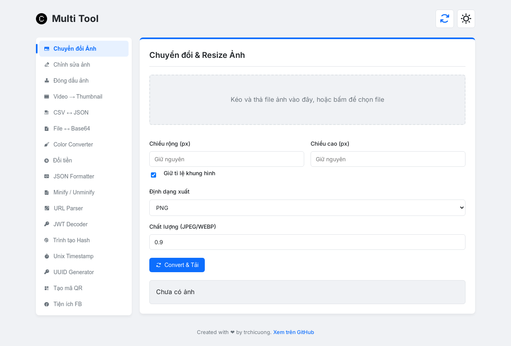

# 🛠️ Multi Tool - Bộ công cụ đa năng

Một ứng dụng web mã nguồn mở gồm hơn 30 công cụ hữu ích cho lập trình viên, được xây dựng bằng JavaScript thuần và Vite, không yêu cầu database (Client-side), tích hợp model AI Google Gemini.

> **[Xem Demo trực tiếp](https://kit.trchicuong.id.vn/)**

---

### 📥 Tải về

**Clone từ GitHub:**
```bash
git clone https://github.com/trchicuong/multi-tool.git
cd multi-tool
```
Hoặc tải file `.zip` trực tiếp từ repository.

---

### ⚙️ Cài đặt & Chạy

1.  **Cài đặt các gói phụ thuộc:**
    ```bash
    npm install
    ```

2.  **Thêm API Key:**
    - Đổi tên file `.env.example` ở thư mục gốc của dự án thành `.env`
    - Mở file `.env` thay thế `your_api_key` bằng API Key của bạn từ Google AI Studio:
      ```
      VITE_AI_API_KEY=your_api_key
      ```

3.  **Chạy server phát triển:**
    ```bash
    npm run dev
    ```

4.  **Truy cập trình duyệt:**
    Mở `http://localhost:5173` (hoặc cổng khác do Vite cung cấp).

5. **Deploy website:**
    Netlify, Vercel,...

---

### 📸 Hình minh họa (version 1.0.0 cũ)



---

### 📁 Cấu trúc thư mục

```
multi-tool/
├── css/
│   └── style.css
├── images/
│   └── ... (png, favicon)
├── js/
│   ├── tools/
│   │   ├── aiChatbot.js
│   │   ├── base64File.js
│   │   └── ... (các file công cụ khác)
│   ├── app.js
│   ├── ui.js
│   └── utils.js
├── .env.example
├── .gitignore
├── index.html
├── LICENSE
├── package.json
└── README.md
└── site.webmanifest
```
---

### 🤝 Đóng góp

Dự án này luôn chào đón các đóng góp! Nếu bạn muốn sửa lỗi, thêm một công cụ mới, hoặc cải thiện mã nguồn, hãy thoải mái tạo một `Pull Request`.

---

### ✉️ Góp ý & Liên hệ

Nếu bạn có bất kỳ ý tưởng nào để cải thiện công cụ hoặc phát hiện lỗi, đừng ngần ngại mở một `Issue` trên repo này.

Mọi thông tin khác, bạn có thể liên hệ với tôi qua:
[**trchicuong.id.vn**](https://trchicuong.id.vn/)